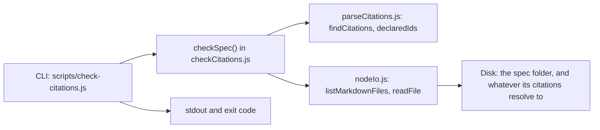

# Design: citation-check

## Overview

A citation is an ordinary markdown link shaped `[Name : ids](target.md)`
([local-workflows-sdd-grammar : 3](../../../../../resources/styles/custom/grammar.md)).
Nothing in this workspace checks whether one still resolves once a
revise renumbers the document it points at - a reviewer reading
`tasks.md` on GitHub sees an ordinary link either way.

This design adds a small, dependency-free Node script that reads every
markdown file in a spec folder, finds every citation in it, and reports
one of two problems for each: the Target_Document does not exist, or it
exists but does not declare a Declared_Id the citation names. It
reports; it changes nothing. It is invoked directly - `node
scripts/check-citations.js <spec-folder>` - so a developer or a CI
check gets an answer without the panel open, which is the whole of
[Requirements : 1](requirements.md)'s story.

This workspace has no build step and no TypeScript source of its own -
`scripts/greet.js` and `.local-workflows/plugins/greetV1/index.js` are
both plain CommonJS, run straight by `node` with nothing installed
first. This design follows that: five small `.js` files, no
`package.json`, no new dependency.

## Architecture



`parseCitations.js` is the one reading of the citation and Declared_Id
grammar - the shape `local-workflows-sdd-grammar.md` §1 and §2
define, and the only spec for it available inside this workspace.
`checkCitations.js` is the orchestrator: pure with respect to the
filesystem, taking an `io` object rather than calling `fs` itself, so
its classification logic (missing file, missing id, silently-undeclared
target) is testable without a real disk. `nodeIo.js` is the one file
that touches `fs`, and the CLI (`scripts/check-citations.js`) is the
thin shell that turns a report into printed lines and an exit code.

### Design Decisions

| Decision | Rationale |
|---|---|
| Ship this as a plain script under `scripts/`, invoked directly with `node`, rather than as a `.local-workflows/plugins/` plugin (`uses: citationCheck@1`) the way `greetV1` is. | [Requirements : 1](requirements.md)'s own story is a developer reviewing a pull request "without opening the panel." A plugin only runs through the task engine - the panel, or a runner this sample workspace does not ship - so it would leave a PR check depending on tooling that is not guaranteed to be there. A script needs only `node`, the same way `scripts/greet.js` and `scripts/hello.ps1` already do. |
| Read the citation and Declared_Id grammar straight from `local-workflows-sdd-grammar.md` §1-§2 and implement it directly, rather than depend on the extension's own parser. | This workspace has no access to the extension's source - it only consumes the extension when opened in VS Code, and carries no `src/` of its own. The grammar document is the one contract both the extension and this script are bound to, and requirements.md's own Introduction names it as the shape the checker reads. |
| `checkSpec` takes an injected `io` (`listMarkdownFiles`, `readFile`) rather than calling `fs` itself; a real-disk implementation (`nodeIo.js`) is handed in only by the CLI. | This is the only way to unit test "target missing" vs. "id missing" vs. "target declares nothing" without building and tearing down real folders for every case - and this workspace has no test framework already in place to lean on for a lighter alternative. |
| A citation to a Target_Document that does not exist produces one finding for the whole citation, not one per id it lists. | Requirements.md's own Assumptions ask for one finding per id specifically for the case where the Target_Document *is* readable and each id's fate is independent of the others. When the file itself cannot be read there is nothing to check any of its ids against - a `"missing-file"` finding once already says everything a per-id repeat of the same fact would, and [Requirements : 1.1](requirements.md) already covers that case on its own. |
| Recognise a Declared_Id from a heading's first whitespace-delimited token only when that token itself carries a digit (after stripping a trailing `.` or `:`), separately from the dedicated `### Requirement N: ...` rule - never from a bullet, a table row, or a word like `Property` that is only followed by a number. | This is the whole of what `local-workflows-sdd-grammar.md` §1-§2 specifies: a `Requirement` heading's id is the bare number, any other scheme's id is its own leading token (`G11`, `FR-1`, or a section number like `2.`). Stripping the trailing punctuation is what lets a citation like `local-workflows-sdd-grammar : 2, 3` resolve against that document's `## 2. Requirements and acceptance criteria` heading. Accepting a wider shape - a bulleted `- **FR-1**: ...`, or treating `Property 1`'s `Property` as an id - would make this script accept a scheme the one grammar available here does not itself declare as citable, and there is nothing in this workspace to check that wider guess against. |

## Components and Interfaces

### `scripts/citations/parseCitations.js` (new)

The one reading of the citation grammar.

```js
// findCitations(content) -> Array<{ link: { href, name, refs }, line }>
// declaredIds(content)   -> Array<string>
```

`findCitations` walks `content` line by line. A line matching a
markdown link `[text](href)` where `href` ends in `.md` and `text` is
`name : id(, id)*` is a citation; `refs` is the comma-split, trimmed id
list, `line` is 1-based. Anything else on the line is an ordinary link,
left alone.

`declaredIds` walks `content` for:

- `### Requirement N: Title` - declares `N`; every `1. `/`2. ` line
  beneath the next `#### Acceptance Criteria` marker, up to the next
  heading, declares `N.M` for its own number `M`.
- Any heading whose first token, once a trailing `.` or `:` is
  stripped, carries a digit - `### G11: ...`, `## 2. Requirements and
  acceptance criteria` - declares that stripped token, once, as its own
  id. A heading whose first token is a bare word - `### Property 1:
  ...` - is not matched by this rule; nothing here treats `Property` as
  a Declared_Id scheme.

### `scripts/citations/nodeIo.js` (new)

```js
// listMarkdownFiles(folderAbsolute) -> Array<string>  (absolute, recursive)
// readFile(fileAbsolute)            -> string | undefined
```

`listMarkdownFiles` recurses the folder with `fs.readdirSync(...,
{ withFileTypes: true })`, collecting `.md` files at any depth -
requirements.md's Assumptions read "every markdown document in the spec
folder," not only its top level. `readFile` is `fs.readFileSync(file,
"utf8")`, `undefined` on any error - a missing file is an answer here,
not a thrown exception, since a citation to one is exactly the case
this checker exists to report rather than crash on.

### `scripts/citations/checkCitations.js` (new)

The classifier. No `fs` of its own.

```js
// checkSpec(specFolderAbsolute, io) -> { findings, citationCount }
// exitCode(report) -> 0 | 1
```

For every file `io.listMarkdownFiles(specFolderAbsolute)` returns:
reads it through `io.readFile`, runs `findCitations`, and for each
occurrence resolves `path.resolve(path.dirname(file), link.href)`.
Target content and its `declaredIds` are each read at most once per
run, cached by resolved path - a Target_Document cited from several
files is only read and parsed once. Per occurrence:

- `io.readFile(target)` is `undefined` → one finding, `kind:
  "missing-file"`, `reference` is `link.href` as written.
- target read, `declaredIds(target).length === 0` → nothing reported
  ([Requirements : 1.3](requirements.md)).
- target read, declares at least one Declared_Id → one finding per id
  in `link.refs` absent from that list, `kind: "missing-id"`,
  `reference` is that id.

`file` on every finding is `path.relative(specFolderAbsolute, file)`,
forward-slashed. `exitCode(report)` is `1` when `report.findings.length
> 0`, else `0`.

### `scripts/check-citations.js` (new)

`node scripts/check-citations.js <spec-folder>` - the only file that
reads `process.argv` or calls `process.exit`.

- No argument → usage on stderr, exit `2`.
- The resolved path does not exist, or is not a directory → error
  naming it on stderr, exit `2`.
- Otherwise: `checkSpec(path.resolve(specFolder),
  require("./citations/nodeIo"))`, then for each finding print
  `${finding.file}:${finding.line}: ${finding.message}` - the
  `file:line:` shape a terminal or an editor already knows how to jump
  to.
- `report.citationCount === 0` → also print "No citations found in
  `<spec-folder>`." ([Requirements : 2.2](requirements.md)), whether or
  not there are findings (there cannot be, with nothing cited to
  fail).
- `process.exitCode = exitCode(report)`.

## Data Models

### SpecRefLink (`parseCitations.js`)

| Field | Type | Description |
|---|---|---|
| `href` | string | The link target exactly as written, relative to the document holding it. |
| `name` | string | The text before the colon, as the author wrote it. |
| `refs` | string[] | The cited Declared_Ids, in the Target_Document's own spelling - `"1.2"`, `"G11"`. |

### CitationOccurrence (`parseCitations.js`)

| Field | Type | Description |
|---|---|---|
| `link` | SpecRefLink | The parsed citation. |
| `line` | number | 1-based line in the document `findCitations` read. |

### Finding (`checkCitations.js`)

| Field | Type | Description |
|---|---|---|
| `file` | string | The citing document, relative to the spec folder that was checked. |
| `line` | number | 1-based line of the citation in `file`. |
| `reference` | string | The `href` (missing-file findings) or the cited Declared_Id (missing-id findings) that failed. |
| `kind` | `"missing-file"` \| `"missing-id"` | Which of the two failures this is. |
| `message` | string | A one-line, print-ready description of the failure. |

### CheckReport (`checkCitations.js`)

| Field | Type | Description |
|---|---|---|
| `findings` | Finding[] | Every citation that did not resolve, in the order its file was walked. |
| `citationCount` | number | Every citation seen across the spec folder, whether or not it resolved. |

## Correctness Properties

### Property 1: A citation to a Target_Document that does not exist is always reported

*For any* citation whose `href` resolves to a path with no file on
disk, THE checker SHALL include a `"missing-file"` finding for it,
regardless of whether the ids it lists would otherwise have resolved.

**Validates: Requirements 1.1**

### Property 2: A citation to an undeclared Declared_Id is reported once per id

*For any* citation naming one or more ids against a Target_Document
that exists and declares at least one Declared_Id of its own, THE
checker SHALL report a separate `"missing-id"` finding for each cited
id absent from that Target_Document's Declared_Ids, regardless of how
many other ids on the same citation do resolve.

**Validates: Requirements 1.2**

### Property 3: A Target_Document that declares no Declared_Id is never a source of missing-id findings

*For any* citation whose Target_Document exists but declares no
Declared_Id anywhere in its content, THE checker SHALL report no
`"missing-id"` finding for any id that citation names, regardless of
what those ids are or how many there are.

**Validates: Requirements 1.3**

### Property 4: The exit code reflects the findings and nothing else

*For any* run of the checker over a spec folder, `exitCode(report)`
SHALL be non-zero if and only if `report.findings` is non-empty,
regardless of `report.citationCount` or whether a "no citations" notice
was printed alongside it.

**Validates: Requirements 1.4**

### Property 5: The checker never writes

*For any* spec folder the checker is pointed at, THE checker SHALL call
nothing on `io` beyond `listMarkdownFiles` and `readFile`, regardless of
what it finds - so no file it reads, in the spec folder or anywhere a
citation resolves to, is ever modified.

**Validates: Requirements 1.5**

### Property 6: Every finding names where to look

*For any* finding the checker reports, THE checker SHALL set `file`,
`line` and `reference` to values that identify the exact citation that
failed, regardless of whether the finding is `"missing-file"` or
`"missing-id"`.

**Validates: Requirements 2.1**

### Property 7: A spec folder with no citations says so

*For any* spec folder in which no markdown file contains a citation,
THE checker SHALL set `citationCount` to `0` and the CLI SHALL print an
explicit notice, regardless of whether the folder's documents are
otherwise well-formed.

**Validates: Requirements 2.2**

## Error Handling

### `checkCitations.js` / `parseCitations.js`

| Scenario | Behaviour |
|---|---|
| `io.readFile` returns `undefined` for a resolved Target_Document. | One `"missing-file"` finding; the Declared_Id check is skipped for that citation - there is nothing to check ids against. |
| A markdown file `io.listMarkdownFiles` named cannot itself be read (deleted mid-run, permissions). | `io.readFile` returns `undefined` for it too; treated as no citations found in it, not a crash. |
| Link text does not match `name : id(, id)*`, or the href does not end in `.md`. | Not a citation - an ordinary link, left alone, the same forgiving read `local-workflows-sdd-grammar.md` §1-§2 describes. |

**Rationale:** every failure this module can meet is a fact about the
spec folder being checked, not about the checker - a bad citation is
exactly what it exists to report, so nothing here throws where a
finding can be produced instead.

### `scripts/check-citations.js`

| Scenario | Behaviour |
|---|---|
| No argument given. | Usage message on stderr, exit `2`. |
| The given path does not exist, or is not a directory. | Error naming the path on stderr, exit `2`. |
| The checker runs to completion. | Findings (if any) and the "no citations" notice (if it applies) printed, exit `exitCode(report)`. |

**Rationale:** `2` marks "the checker could not start" - a usage
mistake, not a finding; `0`/`1` are reserved for "the checker ran and
this is what it found," which is the distinction
[Requirements : 1.4](requirements.md) draws.

## Testing Strategy

This workspace has no test framework installed, so
`scripts/citations/checkCitations.test.js` is a plain script using
Node's built-in `assert`, runnable as `node
scripts/citations/checkCitations.test.js` with no dependency beyond
Node itself - the same zero-install bar every other script here already
clears. It builds an in-memory `io` (a `Map<string, string>` of
absolute path to content) for each case, so no real folder is created
or torn down:

- a citation to a path the map does not have → one `"missing-file"`
  finding ([Requirements : 1.1](requirements.md), Property 1).
- a citation naming three ids where the Target_Document declares two of
  them → two `"missing-id"` findings, one per absent id
  ([Requirements : 1.2](requirements.md), Property 2).
- a citation into a Target_Document with no Declared_Id at all → no
  finding ([Requirements : 1.3](requirements.md), Property 3).
- a spec with only clean citations → `findings` empty, `exitCode`
  returns `0`; a spec with one bad citation → `exitCode` returns `1`
  ([Requirements : 1.4](requirements.md), Property 4).
- a full run whose `io` exposes only `listMarkdownFiles`/`readFile` -
  the fact that nothing else can be called is the guarantee itself
  ([Requirements : 1.5](requirements.md), Property 5).
- every finding's `file`/`line`/`reference` checked against a
  multi-document fixture where the failing citation is not on the
  first line of its file ([Requirements : 2.1](requirements.md),
  Property 6).
- a fixture with citation-free documents → `citationCount === 0`
  ([Requirements : 2.2](requirements.md), Property 7).
- a heading such as `## 2. Requirements and acceptance criteria`
  declares `"2"`, not `"2."` - the trailing-punctuation strip this
  design adds over a plain digit check, exercised because
  requirements.md's own Introduction cites
  `local-workflows-sdd-grammar` by section number.

`scripts/check-citations.js` is not separately unit tested - it is a
thin shell over `checkSpec`/`exitCode`, both covered above. Its own
verification is a real run once it exists: `node
scripts/check-citations.js .local-workflows/specs/citation-check`
against this very spec folder, which by then holds `design.md` and
every citation this design itself writes.

## Assumptions

- A Declared_Id is recognised only through the two heading shapes
  `local-workflows-sdd-grammar.md` §1-§2 define - never through a
  bulleted or table-row style - since that document is the only
  specification of the grammar available inside this workspace (see
  Design Decisions).
- A heading's leading word alone - `Property`, or any word with no
  digit of its own - never declares a Declared_Id, even when a number
  follows it. Requirements.md's grammar reference
  ([local-workflows-sdd-grammar : 2, 3](../../../../../resources/styles/custom/grammar.md))
  only names `Requirement` and a document's own leading-token schemes
  (`G11`, `FR-1`, a bare section number) as citable; a design's
  `### Property N` headings exist to be validated against, in the
  `**Validates:**` line, not to be cited from elsewhere, so this
  checker does not invent a Declared_Id for them.
- The CLI's one argument is the spec folder to check. A citation's
  Target_Document is resolved as a real filesystem path from the citing
  file's own directory, so nothing needs a separate notion of a
  workspace root.
- The "no citations" notice ([Requirements : 2.2](requirements.md)) is
  informational, not a finding, and does not by itself make the exit
  code non-zero: a spec that has only reached `intake.md` has no
  citations yet and is not a broken spec, and
  [Requirements : 1.4](requirements.md) ties the non-zero exit to
  having reported a problem, not to having cited nothing.
- A citation to a Target_Document that does not exist produces one
  finding for the whole citation rather than one per id it lists, since
  there is nothing readable to check any of those ids against - unlike
  the missing-id case, where requirements.md's own Assumptions already
  ask for one finding per id because the Target_Document is readable
  and each id's fate is independent.
- "Every markdown document in the spec folder" (requirements.md's own
  Assumptions) includes ones nested in a subfolder -
  `listMarkdownFiles` recurses rather than reading one level deep.
- No `package.json` or dependency is added. The script runs on Node's
  built-ins only, matching `scripts/greet.js` and
  `.local-workflows/plugins/greetV1/index.js`, both of which already
  run with nothing installed first.
