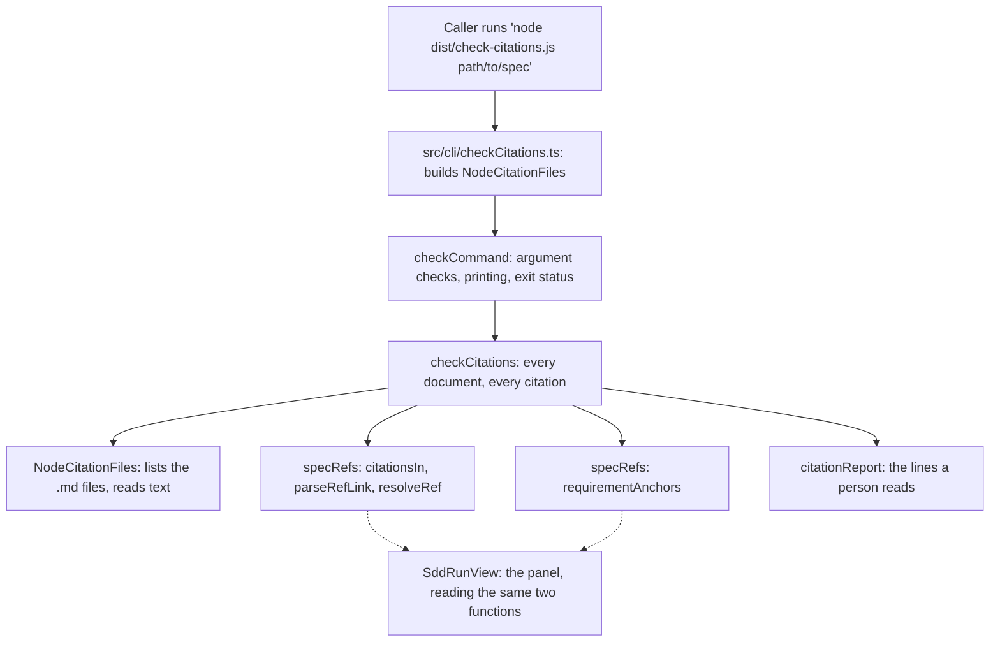

# Design: Citation check

## Overview

The citation checker is a headless reading of a Spec_Folder that prints
every Citation which no longer resolves and exits non-zero when it found
one. It reports; it never edits
([requirements : 1.6](requirements.md)).

The reading itself already exists. `src/webview/templates/specRefs.ts`
decides what counts as a Citation (`parseRefLink`), where a href points
(`resolveRef`), and which Criterion_Ids a document offers
(`requirementAnchors`) - and `SddRunView.tsx` renders a strike-through
from exactly those three answers. Writing a second reader in a CLI would
give the repository two grammars for the same document, which is the
failure the panel's own comments already warn about, and which
[requirements : 4.3](requirements.md) forbids outright.

So this feature is mostly **plumbing around code that is already
written**:

1. `specRefs.ts` moves to `src/sdd/documents/`, where the SDD module
   already keeps its document readings (`parsePlan.ts`,
   `intakeDocument.ts`), and gains one new function - `citationsIn`,
   which finds the Citations in a document's text and the line each sits
   on. The panel switches to it for the scan it already does by hand.
2. A small `src/sdd/citations/` module reads a folder through a port,
   walks its documents, and turns unresolved Citations into Findings.
3. `src/cli/checkCitations.ts` is a second headless entry beside
   `src/cli/runTask.ts`, bundled to `dist/check-citations.js`, whose
   whole job is argv, output and an exit status.

Nothing about the panel's behaviour changes; nothing about the document
grammar changes. What changes is that the answer is now available with
no editor running ([requirements : 6.7](requirements.md)).

## Architecture

The engine is already layered so that the interesting code has no editor
in it, and this feature sits inside that shape rather than beside it:

- `src/sdd/` imports `vscode` nowhere today, and `SddCore` says why:
  the same object has to serve the trees, a test, and whatever asks
  later. The checker's core belongs there.
- `src/sdd/discovery` and `src/sdd/registry` both split a **port** from
  its node implementation (`SpecFiles` / `NodeSpecFiles`, `StyleFiles` /
  `NodeStyleFiles`) so the logic is testable with no disk. The checker
  follows that pattern with `CitationFiles` / `NodeCitationFiles`.
- `src/cli/runTask.ts` is the precedent for a headless entry, and
  `esbuild.js` deliberately leaves `vscode` out of that bundle's
  `external` so the build fails the moment engine code grows an editor
  dependency. The checker's bundle is configured the same way, which is
  what makes [requirements : 6.7](requirements.md) a build-time fact
  rather than a promise.



The dashed edges are the point of the whole design: the panel and the
command are two callers of one reading, so
[requirements : 4.1, 4.2](requirements.md) hold by construction instead
of by a test that compares two implementations and hopes.

**How a run goes.** The command checks its argument, asks the port for
the `.md` files directly inside the folder, and for each one scans the
text for Citations. Each Citation's href is resolved against the folder
of the document that carries it, and the target is read once and cached
- one target is typically cited by every document in the spec. A target
that reads as empty text is missing, and the Citation yields one
Finding. A target that reads as text but offers no Requirement_Anchor is
an Unnumbered_Document, and yields none. Otherwise each Criterion_Id is
looked up on its own, and the ones the target does not offer become one
Finding each.

### Design Decisions

| Decision | Rationale |
|---|---|
| Move `specRefs.ts` to `src/sdd/documents/specRefs.ts` and update the panel's import | The alternative is a node CLI importing `src/webview/templates/`, which names the browser bundle as the home of a reading two surfaces share. `src/core` already forbids reaching into `src/webview` by relative path (`coreBoundary.test.ts`), and `src/sdd/documents` is where document readings live. The move costs two import lines in `SddRunView.tsx` and moving one test file; leaving it costs a dependency that points at the wrong layer forever. |
| Add `citationsIn` to `specRefs.ts` and switch the panel's `cited` memo to it | `SddRunView.tsx` already scans for citations with an inline regex to know which documents to prefetch. Leaving it there and writing a second scanner in the checker is exactly the two-readings problem [requirements : 4.3](requirements.md) exists to prevent. The cost is that the panel prefetches slightly fewer documents (a link inside a code fence no longer counts), which is a fix, not a regression. |
| A regex scan over the text, not a markdown parse | Parsing with `mdast-util-from-markdown` would agree with react-markdown by construction, but it is a transitive, ESM-only dependency that would have to be promoted to a declared one, and the panel would still render from its own parse - so the "one reading" claim would be no stronger. The regex is the one already shipping in `SddRunView.tsx`, and the grammar only ever asks for plain inline links. |
| Fenced code is skipped; four-space indentation is not | A plan's detail lines are indented four spaces inside a list, and that is where nearly every Citation in `tasks.md` lives - treating indentation as code would blind the checker to the documents it exists for. Fences are skipped because the panel does not render a fenced link as a link either, so reporting one would break [requirements : 4.2](requirements.md). |
| A target that reads as empty text counts as missing | The panel decides this with `text === ""`, where a file that is not there arrives as `""` from `SddSpecPanel`. Deciding it with `fs.existsSync` or `hasContent` instead would disagree with the panel on an empty or whitespace-only file - a small edge, but the one place the two readings would part company, and parity is the requirement. |
| A new `CitationFiles` port instead of reusing `SpecFiles` | `NodeSpecFiles.read` refuses any path outside the spec folder (`if (!within(...)) return undefined`), which is right for artifacts and fatal here: [requirements : 1.5](requirements.md) asks for a cited `../../docs/prd.md` to be checked on the same terms as `requirements.md`. Bending `SpecFiles` to allow it would weaken a guard that protects a different feature. |
| `.md` files one level deep, sub-folders never walked | `reviewStore.ts` keeps `.history/` **inside the spec folder** - snapshots of earlier drafts, regenerated by the next run. A recursive walk would report stale citations in yesterday's draft of a document that has since been fixed, which is noise a build would learn to ignore. Matches [requirements : 1](requirements.md) assumption 1. |
| Its own bundle, `dist/check-citations.js` | A subcommand of `run-task.js` would put a spec reader inside the entry whose stated job is proving the *run engine* has no editor in it, and would drag the plugin registry and the agent SDK into a process that reads four markdown files. A separate entry keeps both bundles honest about what they contain. |
| Argument and IO failures exit 2; Findings exit 1 | Only zero-against-non-zero is contracted ([requirements : 6](requirements.md) assumptions), but `runTask.ts` already spends 2 on "could not do the job" and 1 on "did the job, it failed". A caller who wants to tell a broken invocation from a broken spec can; one who does not can test for non-zero. |
| Frontmatter is not split off before scanning | The panel splits it because it renders it as chips and needs body-relative lines for its gutter. The checker wants the file's own numbering ([requirements : 5.2](requirements.md)), and no `Requirement N` heading or Citation can occur inside a YAML frontmatter block - so splitting and adding the offset back would be a moving part that cannot change an answer. |
| Plain text on stdout, one line per Finding | JSON or SARIF would let a CI system annotate a pull request, and is explicitly out of scope ([requirements : 5](requirements.md) assumption 4). A line shaped `file:line` is what an editor's terminal already turns into a link, which is the whole audience for a first version. |

## Components and Interfaces

### 1. Citation scanner

**Lives in** `src/sdd/documents/specRefs.ts` (moved from
`src/webview/templates/specRefs.ts`; its test moves with it to
`src/sdd/documents/__tests__/specRefs.test.ts`).

**Responsibility.** Decide which links in a document's text are
Citations, and say where each one sits. `parseRefLink` and `resolveRef`
are unchanged - they already answer "is this a Citation" and "where does
it point". The new function is the line-aware scan the panel currently
does inline.

```ts
/** A Citation as it was found in a document. */
export interface FoundCitation extends SpecRefLink {

    /** 1-based line of the content it was scanned from - the file's own numbering. */
    line: number;

    /** The whole link as written, `[Requirements : 1.2](requirements.md)`, for the report. */
    written: string;
}

/** Every Citation in a document, in document order, skipping fenced code. */
export function citationsIn(content: string): FoundCitation[];
```

Scanned line by line, with a running "inside a fence" flag toggled by
` ``` ` and `~~~` openers, and inline code spans removed before
matching. The link pattern is the one already in `SddRunView.tsx` -
`/\[([^\]\n]+)\]\(([^)\s]+)\)/g` - and each match is offered to
`parseRefLink`, which drops anything that is not a Citation. A code
fence containing a citation-shaped link - such as the examples in this
document - is therefore invisible to both surfaces.

### 2. Anchor reader

**Lives in** `src/sdd/documents/specRefs.ts`. **Unchanged.**

`requirementAnchors(content)` already offers `N` per `Requirement N`
heading and `N.M` per numbered item under an acceptance-criteria marker,
keyed by the number as written, and already refuses to anchor a numbered
list with no marker above it. That is
[requirements : 3.1, 3.2, 3.3, 3.4](requirements.md) in code that ships
today; the checker calls it and adds nothing. An empty result is what
makes a target an Unnumbered_Document.

### 3. CitationFiles port

**Lives in** `src/sdd/citations/citationFiles.ts`.

**Responsibility.** The only disk the checker knows about, so the check
itself is testable with a map of strings - the same split
`discovery/specFiles.ts` makes.

```ts
export interface CitationFiles {

    /** Whether a path names a folder. False for a file, and for nothing at all. */
    isFolder(target: string): Promise<boolean>;

    /** The `.md` files directly inside a folder - absolute, sorted, sub-folders not walked. */
    documents(folder: string): Promise<string[]>;

    /** A file's text, or `""` when it is not there - the answer the panel gets for a missing document. */
    read(file: string): Promise<string>;
}
```

`read` returns `""` for a file that does not exist and throws for any
other failure, so "missing" and "unreadable" stay different answers -
one is a Finding, the other stops the run
([requirements : 6.6](requirements.md)).

### 4. NodeCitationFiles

**Lives in** `src/sdd/citations/NodeCitationFiles.ts`.

**Responsibility.** `CitationFiles` over `fs`, and the only file in this
feature that touches disk. `documents` is one `readdir` with
`withFileTypes`, keeping `entry.isFile()` and a case-insensitive `.md`
suffix. `read` is `fs.promises.readFile(file, "utf8")` with
`ENOENT`/`ENOTDIR` mapped to `""`. Nothing here opens a file for
writing, which is the whole of
[requirements : 1.6](requirements.md).

### 5. Citation checker

**Lives in** `src/sdd/citations/checkCitations.ts`.

**Responsibility.** The check itself, with no disk, no argv and no
printing.

```ts
export async function checkCitations(folder: string, files: CitationFiles): Promise<CheckResult>;
```

Per document: read it, `citationsIn` it, and for each Citation resolve
`resolveRef(document, href)` and read the target through a `Map` cache
keyed by the resolved path. Then, in order:

1. Target text is `""` - one Finding, `kind: "target"`.
2. `requirementAnchors(text)` is empty - Unnumbered_Document, no
   Finding, and the ids are not looked at.
3. Otherwise, one Finding per id the anchor set does not contain,
   `kind: "criterion"`.

A document that throws on read is recorded in `CheckResult.unreadable`
and the run continues to the next one; a *target* that throws becomes a
`kind: "target"` Finding carrying the reason, because a citation nobody
can follow is a citation the reviewer has to look at either way.

### 6. Report writer

**Lives in** `src/sdd/citations/citationReport.ts`.

**Responsibility.** Turn a `CheckResult` into the lines a person reads,
as a `string[]` so the command decides where they go and a test can read
them without capturing a stream.

```ts
export function citationReport(result: CheckResult, folder: string): string[];
```

One line per Finding, in document then line order, with the document
named relative to the Spec_Folder:

```text
requirements.md:64: [prd : 1.9](prd.md) - prd.md has no 1.9
tasks.md:31: [requirements : 9.1](requirements.md) - requirements.md has no 9.1
design.md:12: [checkout-prd : 3.2](../../docs/checkout-prd.md) - ../../docs/checkout-prd.md is not there
```

Then exactly one closing sentence: the count of Findings when there were
any; "every citation in this spec resolves" when Citations were checked
and none failed; and "this spec folder holds no citations" when none was
found at all ([requirements : 5.5, 5.6](requirements.md)).

### 7. Checker command

**Lives in** `src/sdd/citations/checkCommand.ts`.

**Responsibility.** Argument checking, output and exit status - the
behaviour [requirements : 6](requirements.md) describes, kept out of the
entry file so it can be tested without spawning a process.

```ts
export interface CommandIo {
    out(line: string): void;
    err(line: string): void;
}

export async function checkCommand(argv: string[], files: CitationFiles, io: CommandIo): Promise<number>;
```

No path argument: print
`Usage: node check-citations.js <spec-folder>` and return 2. A path that
is not a folder: say so and return 2. Otherwise run the check, print the
report, and return 2 if anything was unreadable, 1 if there were
Findings, 0 otherwise.

### 8. CLI entry

**Lives in** `src/cli/checkCitations.ts`.

**Responsibility.** The bundle's entry, and nothing else: construct
`NodeCitationFiles`, call `checkCommand` with `console.log`/
`console.error`, and set `process.exitCode`. Shaped like the tail of
`src/cli/runTask.ts`, including its rejection handler.

### 9. Build

**Lives in** `esbuild.js`.

A fifth bundle beside `cli`, `entryPoints: ["src/cli/checkCitations.ts"]`,
`outfile: "dist/check-citations.js"`, `platform: "node"`,
`format: "cjs"`, `external: runtimeDependencies` - and, deliberately,
`vscode` **not** in `external`, so the build breaks if anything
reachable from this entry ever imports the editor. Added to both
`build()` and the watch list in `start()`.

### 10. Spec panel

**Lives in** `src/webview/templates/SddRunView.tsx`.

Two import lines change to `../../sdd/documents/specRefs` and the
`cited` memo calls `citationsIn(body)` instead of running its own
`matchAll`. No rendering, message or state change.

## Data Models

### FoundCitation - `src/sdd/documents/specRefs.ts`

| Field | Type | Description |
|---|---|---|
| `href` | `string` | The link target exactly as written, unresolved. |
| `name` | `string` | The text before the colon - a phase label, a file name. |
| `refs` | `string[]` | The Criterion_Ids, `"1"` or `"1.2"`, in the order cited. |
| `line` | `number` | 1-based line of the content the scan was given. |
| `written` | `string` | The whole link as written, reproduced in the report. |

### Finding - `src/sdd/citations/checkCitations.ts`

| Field | Type | Description |
|---|---|---|
| `document` | `string` | Absolute path of the Spec_Document the Citation was written in. |
| `line` | `number` | 1-based line of that file the Citation sits on. |
| `written` | `string` | The Citation as written - what the reader searches for. |
| `kind` | `"target" \| "criterion"` | Whether the file was missing or the id was. |
| `target` | `string` | Resolved path of the cited document. |
| `ref` | `string \| undefined` | The Criterion_Id that failed; `undefined` for `kind: "target"`. |
| `detail` | `string \| undefined` | Why a target could not be read, when that is why it failed. |

### CheckResult - `src/sdd/citations/checkCitations.ts`

| Field | Type | Description |
|---|---|---|
| `documents` | `string[]` | Spec_Documents that were read, in listing order. |
| `citations` | `number` | Citations found and checked, across all documents. |
| `findings` | `Finding[]` | Every Finding, in document then line order. |
| `unreadable` | `{ file: string; message: string }[]` | Spec_Documents that could not be read. |

### CitationFiles - `src/sdd/citations/citationFiles.ts`

| Field | Type | Description |
|---|---|---|
| `isFolder` | `(target: string) => Promise<boolean>` | Whether the path argument names a folder. |
| `documents` | `(folder: string) => Promise<string[]>` | `.md` files directly inside a folder, absolute and sorted. |
| `read` | `(file: string) => Promise<string>` | The file's text; `""` when absent; throws on any other failure. |

## Correctness Properties

### Property 1: Every document, every citation

*For any* Spec_Folder handed to the citation checker, THE citation
checker SHALL check every Citation in every `.md` file directly inside
that folder, regardless of which of those files a style declares as an
artifact and regardless of the order they are listed in.

**Validates:** [requirements : 1.1](requirements.md)

### Property 2: A target that is not there is one Finding

*For any* Citation whose resolved target reads as empty text, THE
citation checker SHALL report exactly one Finding naming that target as
missing, regardless of how many Criterion_Ids the Citation names.

**Validates:** [requirements : 1.2, 5.4](requirements.md)

### Property 3: An id the target does not offer

*For any* Criterion_Id named by a Citation whose target reads as text
and offers at least one Requirement_Anchor, THE citation checker SHALL
report a Finding for that id exactly when the target's anchors do not
contain it, regardless of whether the other ids in the same Citation
resolve.

**Validates:** [requirements : 1.3, 2.5](requirements.md)

### Property 4: An unnumbered target is silent

*For any* Citation whose target reads as text and offers no
Requirement_Anchor, THE citation checker SHALL report no Finding for any
of its Criterion_Ids, regardless of what those ids are.

**Validates:** [requirements : 1.4, 3.5](requirements.md)

### Property 5: Where a href points

*For any* Citation, THE citation checker SHALL check the file obtained
by resolving its href against the folder holding the Spec_Document that
carries it, regardless of whether that file lies inside or outside the
Spec_Folder.

**Validates:** [requirements : 1.5, 2.4](requirements.md)

### Property 6: The check writes nothing

*For any* run over any Spec_Folder, THE citation checker SHALL leave
every file it read byte-identical and SHALL create, move or delete no
file, regardless of how many Findings it reported.

**Validates:** [requirements : 1.6](requirements.md)

### Property 7: What counts as a Citation

*For any* markdown link, THE citation scanner SHALL treat it as a
Citation exactly when its href names a `.md` file and its text is a
name, a colon and a comma-separated list of Criterion_Ids, and SHALL
report nothing about a link that fails either half, regardless of where
in the document it appears.

**Validates:** [requirements : 2.1, 2.2](requirements.md)

### Property 8: An href that leaves the repository is not a Citation

*For any* link whose href carries a URL scheme or begins `//`, THE
citation scanner SHALL NOT treat it as a Citation, regardless of its
link text or its `.md` suffix.

**Validates:** [requirements : 2.3](requirements.md)

### Property 9: A requirement offers its own number

*For any* document, THE anchor reader SHALL offer the
Requirement_Anchor `N` for each heading naming `Requirement N`,
regardless of the heading's depth or title.

**Validates:** [requirements : 3.1](requirements.md)

### Property 10: A criterion is numbered as written

*For any* numbered item in a list under a requirement's
acceptance-criteria marker, THE anchor reader SHALL offer the
Requirement_Anchor `N.M` where `M` is the number written on the item,
regardless of that item's position in the list.

**Validates:** [requirements : 3.2, 3.4](requirements.md)

### Property 11: A list with no marker offers nothing

*For any* numbered list under a requirement with no acceptance-criteria
marker above it, THE anchor reader SHALL offer none of its items as
Requirement_Anchors, regardless of how the items are numbered or worded.

**Validates:** [requirements : 3.3](requirements.md)

### Property 12: One reading, two surfaces

*For any* Spec_Document and any link inside it, THE citation checker
SHALL reach its verdict from the same `citationsIn`, `parseRefLink`,
`resolveRef` and `requirementAnchors` the Spec_Panel renders from - so a
link the panel leaves as ordinary text yields no Finding and a reference
the panel strikes through yields one - regardless of which document the
link points at.

**Validates:** [requirements : 4.1, 4.2, 4.3](requirements.md)

### Property 13: A Finding says where it is and what failed

*For any* Finding, THE report writer SHALL name the Spec_Document it was
found in, the 1-based line of that file the Citation sits on, the
Citation as written, and whether the target file or the Criterion_Id was
missing, regardless of the kind of failure.

**Validates:** [requirements : 5.1, 5.2, 5.3, 5.4](requirements.md)

### Property 14: Silence still gets a sentence

*For any* run that reported no Finding, THE report writer SHALL print
that the spec's Citations resolve when at least one Citation was
checked, and that the folder holds no Citation when none was found,
regardless of how many documents were read.

**Validates:** [requirements : 5.5, 5.6](requirements.md)

### Property 15: The exit status follows the Findings

*For any* completed run, THE checker command SHALL exit zero exactly
when it reported no Finding and non-zero otherwise, regardless of how
many Citations were checked.

**Validates:** [requirements : 6.1, 6.2](requirements.md)

### Property 16: No path is a usage error

*For any* invocation with no path argument, THE checker command SHALL
print how to invoke it and exit non-zero, regardless of the working
directory it was started in.

**Validates:** [requirements : 6.3, 6.4](requirements.md)

### Property 17: A path that is not a folder

*For any* path argument that does not name a folder, THE checker command
SHALL say that the path is not a folder and exit non-zero, regardless of
whether the path names a file or nothing at all.

**Validates:** [requirements : 6.5](requirements.md)

### Property 18: An unreadable document is never passed over

*For any* `.md` file in the Spec_Folder that cannot be read, THE checker
command SHALL name that file and exit non-zero, regardless of whether
the documents it could read produced any Finding.

**Validates:** [requirements : 6.6](requirements.md)

### Property 19: No editor anywhere in it

*For any* build of the checker command, THE checker command SHALL run
under plain node with no editor API reachable from its module graph,
regardless of what the extension bundle imports.

**Validates:** [requirements : 6.7](requirements.md)

## Error Handling

### Checker command - `src/sdd/citations/checkCommand.ts`

| Scenario | Behaviour |
|---|---|
| No path argument | Prints `Usage: node check-citations.js <spec-folder>` to stderr, returns 2. |
| Path names a file, or nothing | Prints the path and that it is not a folder, returns 2. |
| Folder holds no `.md` file | Prints that the folder holds no citations, returns 0 - an empty folder is not a failure. |
| One or more documents unreadable | Prints each file and the reason, prints the report for the rest, returns 2. |
| Findings reported | Prints them, returns 1. |
| Unexpected exception | The entry's rejection handler prints the stack and sets exit code 2. |

**Rationale:** the command owns every answer that is about the *run*
rather than about a Citation, and each one still prints something a
person can act on. An unreadable document exits non-zero even when the
documents that were read are clean, because a check that silently
skipped a file would report "everything resolves" about a spec it did
not finish reading - the one lie this feature exists to prevent.

### Folder reader - `src/sdd/citations/NodeCitationFiles.ts`

| Scenario | Behaviour |
|---|---|
| Sub-folder in the Spec_Folder (`.history/`, `contracts/`) | Not listed and not walked. |
| Non-`.md` file (`review.json`) | Not listed. |
| Cited target does not exist | `read` returns `""`; the checker calls it missing. |
| Cited target exists but cannot be read | `read` throws; the checker turns it into a `kind: "target"` Finding carrying the reason. |
| Cited target resolves outside the workspace | Read like any other file. Never written to. |
| Same target cited from several documents | Read once, cached by resolved path for the run. |

**Rationale:** absence is normal and everything else is not. A Citation
pointing at a file that was moved is the ordinary case this feature was
built for, so it is data; a permissions error is a machine problem the
reader should not disguise as drift. Reading outside the workspace is
allowed because the panel already does it - `SddSpecPanel` reads
whatever path a citation resolves to - and refusing here would make the
headless verdict differ from the one on screen.

### Scanner and checker - `src/sdd/documents/specRefs.ts`, `src/sdd/citations/checkCitations.ts`

| Scenario | Behaviour |
|---|---|
| A link that is not shaped like a Citation | Ignored, reported nowhere. |
| A citation-shaped link inside a fenced code block | Ignored - the panel renders it as code, not a link. |
| An href with a fragment, a query, a scheme, or `//` | Not a Citation; `parseRefLink` already refuses all four. |
| A malformed id (`1.2.3`, `abc`) | The text fails the citation shape, so the whole link is not a Citation and nothing is reported. |
| A target that offers no anchors | Unnumbered_Document; ids are not looked at. |
| A target that offers the same id twice | Resolves. The anchor set is a set, and duplicate numbering is the document's problem, not the checker's. |
| A document citing itself | Checked against its own anchors, like any other target. |

**Rationale:** forgiving in exactly the way the panel is forgiving. The
comment at the top of `specRefs.ts` states the rule this table
implements - a link that does not match is a link, never an error, and
only a reference that matches and points nowhere is reported. Every row
here is a case where reporting would call correct work broken, which
costs more trust than the missed edge case saves.

## Testing Strategy

Unit tests beside the code in `__tests__` folders, run by
`npm test` (vitest, node environment, inline fixtures) - the convention
every module in `src/sdd` already follows.

| What | Where | How each requirement is verified |
|---|---|---|
| Scanner | `src/sdd/documents/__tests__/specRefs.test.ts` (the moved file, extended) | `citationsIn` over an inline document: a real Citation with its line, an ordinary link, a link with a scheme, a protocol-relative link, a citation inside a fence, a citation on a four-space-indented plan detail line. Covers requirement 2 and, with the cases already in this file, requirement 3. |
| Checker | `src/sdd/citations/__tests__/checkCitations.test.ts` | A hand-written `CitationFiles` over a `Record<string, string>` - no disk. Cases: a resolving citation, a missing target, an unknown id, an unnumbered target, a target reached with `../`, a citation naming three ids of which one fails, a document that throws on read. Covers requirement 1 and the id-by-id half of requirement 2. |
| Report | `src/sdd/citations/__tests__/citationReport.test.ts` | Lines asserted whole: a Finding line carries file, `:line:`, the citation as written and which half failed; the "all resolve" sentence; the "no citations" sentence. Covers requirement 5. |
| Command | `src/sdd/citations/__tests__/checkCommand.test.ts` | `checkCommand` called with argv and a fake `CitationFiles`, collecting `out`/`err` into arrays: no argument, a path that is not a folder, a clean folder, a folder with Findings, a folder with an unreadable document. Asserts both the return code and the text. Covers requirement 6, criteria 1-6. |
| Panel parity | `src/sdd/citations/__tests__/panelParity.test.ts` | The same fixture document run through `checkCitations` and through the functions `SddRunView` calls (`citationsIn` + `parseRefLink` + `requirementAnchors`, with the panel's own `missing`/`unnumbered` expressions), asserting the two verdicts agree link for link. Covers requirement 4 - and note that the panel's `cited` memo now calls `citationsIn`, so the test guards a shared function rather than two implementations. |
| Boundary | `src/sdd/citations/__tests__/checkerBoundary.test.ts` | The import walk `coreBoundary.test.ts` already uses, applied to `src/sdd/citations` and `src/cli/checkCitations.ts`: no file imports `vscode`, and none reaches into `src/vscode` or `src/webview` by relative path. Covers requirement 6, criterion 7 in the suite; `npm run build` covers it again by failing the bundle. |

Two things are deliberately not tested. Nothing spawns
`node dist/check-citations.js`, because the entry file holds only
argv-to-`checkCommand` wiring and the suite does not build first - the
bundle is the build's assertion, not vitest's. And no test asserts the
absence of writes byte for byte (Property 6); it is held by
`NodeCitationFiles` being the only file in the feature that imports
`fs`, and by that file calling no write API - which the boundary test's
import walk is the right place to extend if it ever stops being obvious.

## Assumptions

1. The `.md` files a run reads are the ones directly inside the
   Spec_Folder, matching [requirements : 1](requirements.md)
   assumption 1 and keeping `.history/` snapshots out of the report.
2. A target that reads as empty text is treated as missing, which is how
   the panel behaves. A zero-byte `requirements.md` therefore reports as
   a missing target rather than as an Unnumbered_Document.
3. `specRefs.ts` moves to `src/sdd/documents/`. This is the only file
   the feature relocates, and the only production file that imports it -
   `SddRunView.tsx` - changes two import lines. Its existing test moves
   unchanged so its history of asserted behaviour survives the move.
4. Findings are printed in document then line order, with documents in
   the order the folder listed them (sorted). No grouping, no colour, no
   width-aware wrapping.
5. Exit 1 means Findings and exit 2 means the run could not do its job.
   Only "non-zero" is contracted, so a caller may test for either.
6. The checker follows a Citation wherever it resolves, including
   outside the workspace, and reads nothing else. It is a reader with no
   allow-list, exactly as the panel is today.
7. One Spec_Folder per invocation. Running it over every spec in a
   repository is a shell loop, per
   [requirements : 1](requirements.md) assumption 7.
8. The command is invoked as `node dist/check-citations.js <folder>`.
   No npm script, editor command or task template is added by this
   feature; wiring it into a build is the caller's business.
