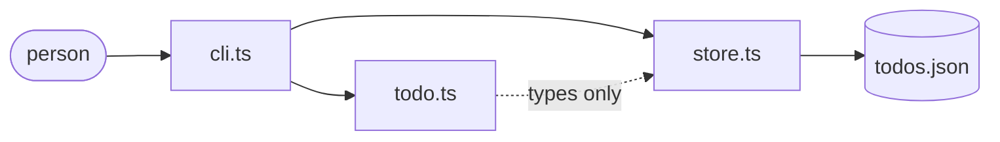

# Design Document

## Overview

Three files, in a straight line. A list that is only functions over
plain data, a store that is the only thing touching disk, and a command
line that reads one, calls the other, and prints.

The split exists so the rules can be tested without a temp folder. Every
acceptance criterion in requirements 1 to 4 is a claim about the list,
and none of them need a file to check. Requirement 5 is the only one
that needs disk, and it lives in one file.

Nothing is asynchronous except reading and writing the file, and nothing
holds state between calls. Each command loads the whole list, produces a
new list, writes it, and exits.

## Architecture



`cli.ts` is the only file that knows a person exists, and the only one
that prints or sets an exit code. `store.ts` is the only file that
touches disk. `todo.ts` knows about neither, which is why its tests are
plain function calls with no setup.

The arrow from `todo.ts` to `store.ts` is types only. The store reads
and writes a `TodoState`; it never decides what a valid one is.

### Design Decisions

| Decision | Rationale |
|---|---|
| Plain functions over a class | Every operation takes a list and returns a new one, so a test is one call and one comparison. A class would have to be built, mutated and then inspected, and the mutation is the part that makes an ordering bug hard to see. |
| The whole file is written every time | A todo list is a few kilobytes. An append log or a patch would be faster and would add a second way for the file to be wrong; there is nothing to gain at this size. |
| Write to a temporary file, then rename | Rename on one filesystem is atomic, so a crash halfway through leaves the previous list intact. Writing in place would leave half a list, which requirement 5.5 forbids. |
| JSON, not a database | The file is meant to be readable and fixable by hand. Someone who breaks it can open it; someone who breaks a database cannot. The cost is that a bad file has to be detected, which requirements 5.3 and 5.4 already ask for. |
| Ids count up and are never reused | The alternative, filling the gaps, means an id printed yesterday can mean a different item today. Both were open; only one of them can be typed back safely. |
| The clock is an argument to `add` | `createdAt` would otherwise make every test depend on the time it ran. Passing a `Date` in costs one parameter with a default, and makes the timestamp something a test can assert. |
| Nothing is re-validated on load beyond shape | The store checks the JSON holds items with the right field types, and stops. Re-running the title rules on load would mean a file written by an older version could refuse to open, which is worse than a long title. |

## Components and Interfaces

### The list - `src/todo.ts`

Holds every rule about what a valid list is. No imports, no disk, no
console.

```ts
export function emptyState(): TodoState;
export function add(state: TodoState, title: string, now?: Date): TodoState;
export function setDone(state: TodoState, id: number, done: boolean): TodoState;
export function remove(state: TodoState, id: number): TodoState;
export function list(state: TodoState, filter?: Filter): Todo[];
export function isFilter(value: string): value is Filter;
export class TodoError extends Error {}
```

Every function that can refuse throws `TodoError`. Nothing here returns
an error code, because there is exactly one caller and it prints the
message either way.

`setDone` takes a boolean rather than there being a `complete` and a
`reopen`. The two differ by one value, and requirement 2.3 says both are
allowed to do nothing, so one function makes that one place instead of
two.

### The store - `src/store.ts`

The only file that touches disk.

```ts
export const DEFAULT_PATH = "todos.json";
export function load(path?: string): Promise<TodoState>;
export function save(state: TodoState, path?: string): Promise<void>;
```

`load` turns a missing file into an empty list and a broken file into a
`TodoError`. `save` writes to `<path>.tmp` and renames it over the
target.

### The command line - `src/cli.ts`

Reads the command, loads the list, calls one function, saves, prints,
and sets an exit code. It is the only file that reads an environment
variable or writes to the console.

## Data Models

### Todo

| Field | Type | Description |
|---|---|---|
| `id` | number | Unique within the Todo_List, counting from 1. Never reused. |
| `title` | string | 1 to 200 characters, already trimmed. |
| `done` | boolean | `true` is Done, `false` is Active. |
| `createdAt` | string | ISO 8601, in UTC. Recorded, not shown anywhere yet. |

### TodoState

This is both the in-memory state and the whole file on disk.

| Field | Type | Description |
|---|---|---|
| `nextId` | number | The id the next added item gets. Only ever increases. |
| `items` | Todo[] | Every Todo_Item, in the order they were added. |

Storing `nextId` rather than working it out from `items` is what makes
requirement 3.2 hold. The largest id in `items` goes down when the last
item is deleted; `nextId` does not.

## Correctness Properties

### Property 1: An id is never issued twice

*For any* sequence of additions and deletions, THE todo list SHALL give
each new Todo_Item an id greater than every id it has issued before,
regardless of how many Todo_Items have been deleted.

**Validates: Requirements 1.1, 3.2**

### Property 2: A stored title is trimmed and within bounds

*For any* title the todo list accepts, the stored value SHALL equal the
input with leading and trailing whitespace removed, and its length SHALL
be between 1 and 200, regardless of how much whitespace was given.

**Validates: Requirements 1.2, 1.3, 1.4**

### Property 3: Order is the order things were added

*For any* sequence of operations, THE todo list SHALL return Todo_Items
in the order they were added, regardless of which have been completed,
reopened or deleted.

**Validates: Requirements 1.5, 4.1**

### Property 4: Setting a state twice is the same as setting it once

*For any* Todo_Item and any state, applying that state twice SHALL
produce the same Todo_List as applying it once, regardless of the state
the Todo_Item was in.

**Validates: Requirements 2.1, 2.2, 2.3**

### Property 5: An unknown id changes nothing

*For any* id that no Todo_Item holds, THE todo list SHALL refuse the
request and leave the Todo_List exactly as it was, regardless of which
operation was asked for.

**Validates: Requirements 2.4, 3.3**

### Property 6: Deleting removes exactly one Todo_Item

*For any* Todo_List and any id it holds, THE todo list SHALL return a
list holding every other Todo_Item and not that one, regardless of the
Todo_Item's state or position.

**Validates: Requirements 3.1**

### Property 7: The two filters partition the list

*For any* Todo_List, the active result and the done result together
SHALL hold every Todo_Item exactly once, regardless of how many fall
into each.

**Validates: Requirements 4.2, 4.3**

### Property 8: An unrecognised filter is refused before the list is read

*For any* value that is not all, active or done, THE command line SHALL
refuse the request and name the three values it accepts, regardless of
what the Todo_List holds.

**Validates: Requirements 4.4**

### Property 9: An empty result is stated

*For any* filter whose result holds no Todo_Items, THE command line
SHALL print a line saying so, regardless of whether the Todo_List itself
is empty.

**Validates: Requirements 4.5**

### Property 10: Saving then loading returns the same list

*For any* Todo_List and any path, saving it and then loading that path
SHALL return an equal Todo_List, regardless of what the file held
before.

**Validates: Requirements 5.1, 5.6**

### Property 11: A missing file is an empty list

*For any* path with no file at it, THE store SHALL return an empty
Todo_List rather than failing, regardless of whether the folder above it
exists.

**Validates: Requirements 5.2**

### Property 12: A file that is not a Todo_List stops the command

*For any* file whose contents are not valid JSON, or are valid JSON that
does not hold a Todo_List, THE store SHALL raise a TodoError naming the
path, regardless of how close the contents are to correct.

**Validates: Requirements 5.3, 5.4**

### Property 13: A write leaves either the old list or the new one

*For any* write that does not finish, the Todo_File SHALL still hold the
Todo_List it held before, regardless of when the write stopped.

**Validates: Requirements 5.5**

### Property 14: The exit status matches the outcome

*For any* command, THE command line SHALL exit zero when it did what was
asked and non-zero when it refused, regardless of which command it was.

**Validates: Requirements 6.1, 6.3**

### Property 15: An unexpected failure is not disguised as a user error

*For any* failure that is not a TodoError, THE command line SHALL print
the error itself rather than a one-line summary of it, regardless of
where it came from.

**Validates: Requirements 6.2**

## Error Handling

### The list

| Scenario | Behaviour |
|---|---|
| Title is empty after trimming | Throw `TodoError` saying a title is needed |
| Title is over 200 characters | Throw `TodoError` naming the limit and the length given |
| Id does not exist | Throw `TodoError` naming the id |

**Rationale:** Throwing rather than returning an error value, because
there is one caller and it prints the message in every case. A returned
error would be unwrapped at every call site and then printed anyway.

### The store

| Scenario | Behaviour |
|---|---|
| File does not exist | Return an empty Todo_List |
| File is not valid JSON | Throw `TodoError` naming the path and saying to fix it or delete it |
| File is JSON of the wrong shape | Throw `TodoError` naming the path |
| Any other read failure | Let it through unchanged |
| Write fails partway | The rename never happens, so the previous file stands |

**Rationale:** A missing file is the first run, not a fault. Everything
else is either something a person can fix by opening the file, or a
fault they cannot act on - and those two need different messages, which
is why only the first two are converted.

### The command line

| Scenario | Behaviour |
|---|---|
| A `TodoError` | Print the message on its own, exit 1 |
| Any other error | Print the error, exit 1 |
| Unknown command | Print the usage, exit 1 |
| No command at all | Print the usage, exit 0 |
| Success | Print the result, exit 0 |

**Rationale:** A `TodoError` is something the person did, so the message
is the whole answer and a stack trace is noise. Anything else is a
defect, and hiding it behind one line would cost the debugging.

## Testing Strategy

Unit tests, run with vitest. There is no integration layer to test
separately - three files with one dependency each.

| Requirement | How it is verified |
|---|---|
| 1 | `todo.test.ts`: the first id, trimming, an empty title, a title one over the limit and one exactly at it, and insertion order |
| 2 | `todo.test.ts`: complete, reopen, completing twice, and an unknown id |
| 3 | `todo.test.ts`: delete, then add and check the id was not reused, and an unknown id |
| 4 | `todo.test.ts`: each of the three filters, an empty result, and `isFilter` rejecting a fourth value |
| 5 | `store.test.ts`, against a real temporary folder: missing file, round trip, bad JSON, wrong shape, no leftover temporary file, and a second save replacing the first |
| 6 | The tests above assert the `TodoError` message on every refusal. The exit codes are exercised by running the command line |

Requirement 5.5 is checked by its consequence rather than directly: a
successful `save` leaves no `.tmp` file behind, which is what proves the
rename is the last thing that happens. Simulating a crash mid-write
would need a fault-injecting filesystem, and that costs more than it
adds over the rename itself.

## Assumptions

- **`createdAt` is stored and not shown.** Nothing in the requirements
  asks to see it or to sort by it. It is recorded because it cannot be
  recovered later, and showing it is a one-line change when someone
  asks.
- **Ids are integers from 1.** Requirement 1.1 asks only that they are
  not reused. Numbers count up, read cleanly on screen, and are typed
  back without quoting.
